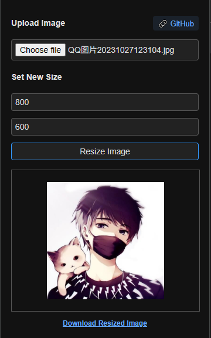

# 🖼️ Image Resizer with Transparent Padding (Chrome Extension)

A lightweight browser extension that resizes images to custom dimensions with transparent padding. Supports dark/light system themes automatically.

## ✨ Features

- 📐 Resize uploaded images to any width and height
- 🧊 Automatically fill extra space with **transparent padding**
- 🌓 Follows your system theme (light/dark)
- 💾 Download resized images as PNG
- 🎨 Simple and intuitive UI

## Installation

1. Clone or download this repository:
   ```bash
   git clone https://github.com/yang-shuohao/resize-image.git
2. Open Chrome and go to chrome://extensions/

3. Enable "Developer mode" (top right)

4. Click "Load unpacked" and select the extension folder (resize-image)

5. The extension will be installed and its icon will appear near the address bar

## Usage
1. Click the extension icon to open the popup.

2. Upload an image from your computer.

3. Enter your desired width and height.

4. Click Resize Image.

5. Preview the result and download as PNG.

📌 Extra area will be filled with transparent pixels (not white or black).

## 🖼️ Screenshot


## 💰 Support This Project

If you find this project helpful, consider sponsoring or treating me a coffee ☕:

### 🧧 Donate via Chinese Payment (国内用户可扫码打赏)

<p align="center">
  
  
</p>

### 🌍 International Support

- [💸 Donate via PayPal](https://paypal.me/yangshuohao?country.x=C2&locale.x=zh_XC)

> Thank you for your support!